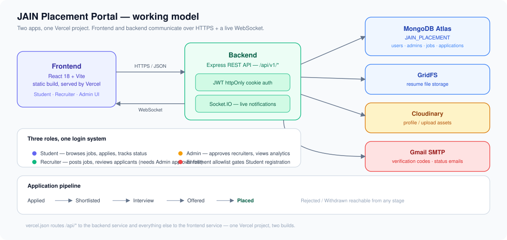

# JAIN Placement Portal

The official placement portal for JAIN (Deemed-to-be University), Bengaluru — connecting students, recruiters, and the Training & Placement Office in one place.

## Overview

Students browse and apply to job openings, recruiters post roles and review applicants, and the placement office approves recruiters and tracks outcomes. A student can only register with a JAIN enrollment number and matching college email; a recruiter can only post jobs once approved by the placement office.

## Roles

| Role | Who | Can do |
|---|---|---|
| **Student** | JAIN students, gated by an enrollment allowlist | Browse openings, apply, track application status, manage resume |
| **Recruiter** | Companies hiring on campus | Post/edit job openings, review applicants, move candidates through the pipeline |
| **Admin** | Placement office staff | Approve/decline recruiters, view placement analytics, browse the student directory |

Application pipeline: `Applied → Shortlisted → Interview → Offered → Placed`, with `Rejected`/`Withdrawn` reachable from any stage.

## Architecture

Two independent apps in one repository, deployed as separate services behind a single Vercel project.



- **Frontend** — React 18 + Vite, built to a static bundle and served by Vercel.
- **Backend** — Express REST API. `server.js` runs it locally as a long-lived process (needed for Socket.IO); on Vercel it runs as a serverless function per request, so Socket.IO is a local-dev-only feature.
- **Database** — MongoDB Atlas, single database `JAIN_PLACEMENT`, three account-bearing collections (`users` for Students/Recruiters, `admins` for the placement office, plus a `studentallowlists` roster of valid enrollment numbers).
- **File storage** — resumes live in MongoDB GridFS, not on disk (serverless functions have no persistent filesystem).
- **Auth** — JWT in an httpOnly cookie, one token format shared across all three roles; middleware resolves which collection (`users` vs `admins`) a token belongs to.
- **Routing** — `vercel.json` defines two services (`frontend`, `backend`) under one project and rewrites `/api/*` to the backend, everything else to the frontend.

### Project structure

```
placement-portal/
├── backend/              # Express API — see backend/README.md
├── frontend/             # React + Vite client
├── docs/
│   └── architecture.svg  # the diagram above
├── .env.example          # env var template — copy into backend/.env
├── vercel.json           # two-service Vercel deployment config
└── package.json          # workspace-root convenience scripts only
```

### Backend module layout

```
backend/
├── server.js                # local dev entrypoint (Express + Socket.IO)
├── app.js                   # Express app, middleware, route mounting
├── routes/                  # one file per resource (user, admin, job, application, resume, notification)
├── controllers/             # request handlers — all business logic lives here
├── models/                  # Mongoose schemas
├── middlewares/             # auth, error handling, rate limiting
├── utils/                   # email sending, GridFS helpers, JWT helpers
├── config/                  # env access, branding constants
├── database/                # Mongo connection setup
├── data/                    # seed data (student enrollment allowlist CSV)
├── seed.js                  # demo account seeding (idempotent)
├── seedJobs.js              # demo job listings
└── seedStudentAllowlist.js  # demo enrollment-number roster
```

### Frontend module layout

```
frontend/src/
├── components/
│   ├── Auth/          # login, register
│   ├── Dashboard/     # per-role dashboard (Student / Recruiter / Officer)
│   ├── Job/           # job listing, posting, editing
│   ├── Application/   # applicant review, resume viewer
│   ├── Officer/       # recruiter approvals, student directory, analytics
│   ├── Profile/       # account settings
│   └── ui/            # shared design-system primitives
├── lib/               # api client, role helpers, react-query-style data hook
└── App.jsx            # routing, role-gated route guards
```

## Getting started

Requires Node 18+ and a MongoDB Atlas connection string.

```bash
git clone <repo-url>
cd placement-portal
npm --prefix backend install
npm --prefix frontend install

cp .env.example backend/.env   # then fill in real values
npm run seed                    # creates demo Student/Recruiter/Admin accounts + jobs
npm run dev                     # starts the backend on :4000
npm run dev:frontend            # in a second terminal, starts the frontend on :5173
```

Ports are fixed — the frontend hardcodes `http://localhost:4000` for API calls, so the backend must run on `4000` and the frontend on `5173`.

### Demo accounts (after `npm run seed`)

| Role | Email | Password | Code |
|---|---|---|---|
| Student | `student@jain.test` | `Student@123` | — |
| Recruiter | `tnp@jain.test` | `Recruiter@123` | `123456` |
| Admin | `tpo@jain.test` | `Admin@123` | `123456` |

Recruiter and Admin logins require a fresh emailed verification code every sign-in; with no SMTP configured, use the fixed seed code above instead of requesting a new one.

## API surface

All routes are mounted under `/api/v1/`:

| Prefix | Handles |
|---|---|
| `/user` | Student + Recruiter register/login/profile |
| `/admin` | Placement office register/login, recruiter approvals, analytics, student directory |
| `/job` | Job CRUD, listing, search |
| `/application` | Apply to a job, review applicants, status transitions |
| `/resume` | Resume upload/download via GridFS |
| `/notification` | In-app notification feed |

## Deployment

Configured for Vercel via the root `vercel.json`: the frontend builds as a static Vite site, the backend runs as a serverless Express service, and `/api/*` traffic is routed to it. Environment variables are set in the Vercel dashboard rather than committed — see `.env.example` for the full list required.
